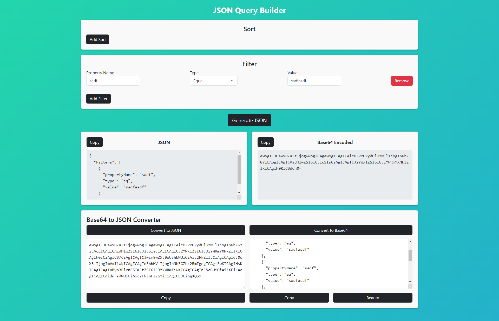

# JSON Query Builder

This web application was created for a Company to allow users within the organization to dynamically build JSON queries through an easy-to-use interface. It is specifically designed to generate JSON with a predefined structure required by the company's systems by filling in inputs, adding or removing values, and generating the resulting JSON with the click of a button.



Below is an example of the JSON structure that this application generates:

```json
{
  "Sorts": [
    {
      "propertyName": "name",
      "descending": true
    }
  ],
  "Filters": [
    {
      "propertyName": "name",
      "type": "eq",
      "value": "Example"
    }
  ]
}
```

## Table of Contents
- [JSON Query Builder](#json-query-builder)
  - [Table of Contents](#table-of-contents)
  - [Installation](#installation)
  - [Usage](#usage)
  - [Contributing](#contributing)
  - [Acknowledgements](#acknowledgements)

## Installation

Follow these steps to install and run the JSON Query Builder on your local machine:

1. Clone the repository:

```bash
git clone https://github.com/yourusername/json-query-builder.git
```

2. Navigate to the project directory:

```bash
cd json-query-builder
```

3. Install the dependencies:

```bash
npm install
```

4. Start the application:

```
npm start
```

This will run the app in development mode. Open [http://localhost:3000](http://localhost:3000) to view it in your browser. The page will reload when you make changes to the code.

## Usage

1. **Fill in the Inputs**: Use the input fields to specify the properties for the query you want to build. You can add or remove properties as needed.

2. **Generate JSON**: Once you've filled in the necessary information, click the 'Generate JSON' button. This will produce the JSON query based on the information you provided.

3. **Copy the Result**: You can now copy the resulting JSON to your clipboard for use in your application or for saving to a file.

## Contributing

Contributions to JSON Query Builder are welcome! If you have an idea for a feature or enhancement, or if you've found a bug, please open an issue to discuss it. Pull requests are also appreciated. Please make sure that your code follows the existing style for consistency.

## Acknowledgements

This project was bootstrapped with [Create React App](https://github.com/facebook/create-react-app).


